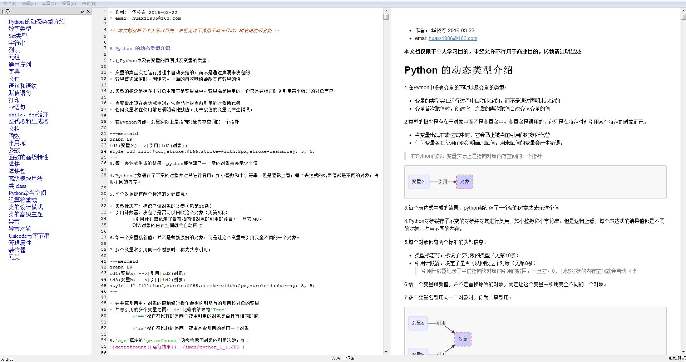

# python 学习笔记
<!--
    作者：华校专
    email: huaxz1986@163.com
**  本文档可用于个人学习目的，不得用于商业目的  **
-->
本文档是《learning python》中文第四版的学习笔记，是由我个人做的纸质读书笔记而来。
>* 文档PDF版本可能会滞后于项目进度
>* 纸质笔记可以从百度网盘下载：http://pan.baidu.com/s/1miEkaBu
>* 个人所作的所有笔记也可以从百度网盘下载：http://pan.baidu.com/s/1boSzlx1

  

# 目标
这份笔记的目标是为了给出一份比较精炼，但是又要浅显易懂的Python教程。《Python学习手册》中文第四版虽然比较简单，但是措辞比较罗嗦，而且一个语法点往往散落在多个章节，不方便读者总结。

我在做笔记时，将一个知识点的内容都统筹在一个章节里面，因此提炼性大大提高。而且还有《Python学习手册》中文第四版的翻译在某些章节（可能难度较大？）措辞可能前后矛盾。当知识点提炼之后就能够很快的找到一些难以理解的概念的上下文，方便吃透这些难点。

# 内容介绍
本文档一共35个章节。分别为：

1. Python的动态类型介绍
2. 数字类型
3. Set类型
4. 字符串
5. 列表
6. 元组
7. 通用序列
8. 字典
9. 文件
10. 语句和语法
11. 赋值语句
12. 打印
13. if语句
14. while/for循环
15. 迭代器和生成器
16. 文档
17. 函数
18. 作用域
19. 参数
20. 函数的高级特性
21. 模块
22. 包
23. 模块的高级用法
24. 类class
25. Python名字空间
26. 运算符重载
27. 类的设计模式
28. 类的高级主题
29. 异常机制
30. 异常对象
32. Unicode与字节串
32. 管理属性
33. 装饰器
34. 元类
35. Python的执行

# 基础知识
看这份笔记最好有面向对象的概念。因为这份文档里大量使用了面向对象的术语，比如”实例对象“、”类对象“、”名字空间“等等。如果没有面向对象的概念，将会对理解后面的大部分章节有困难。

对于Python新手，这份文档难度不大。但是如果您对Python有一定的熟练程度，您会发现这份文档行云流水，一气呵成，阅读起来就没有停顿感。如果您对于Python完全陌生，那么本文档阅读过程中，对于一些复杂的概念建议您动手练手而不要完全依赖于文档中的示例。

# 补充

* 本文档所有的Python代码都是基于Python 3.5 64bit，在Python IDLE上运行的效果。操作系统为 Win7 64bit Professional

* 本文档由` markdown` 语法制作而成，其中使用到了扩展的非标准`markdown`语法（流程图功能）。本人制作了一份`markdown`教程，项目地址在：https://github.com/huaxz1986/markdown_documentation_chinese .你也可以在百度网盘下载PDF版本：http://pan.baidu.com/s/1qWXaJRA 
* 本文档编辑器使用`cutemarked`软件。它是一款开源的`markdown`文件编辑器，支持流程图扩展与`LATEX`数学公式扩展。本人fork了一个版本，然后改装成了一个本地化版本，项目地址： https://github.com/huaxz1986/CuteMarkEd 。你也可以在百度网盘下载我编译打包好的版本（解压缩直接双击运行即可），地址：http://pan.baidu.com/s/1dEqupZ7 ,运行环境为 Win7 64bit Professional
>`cutemarked`原版需要联网下载所需要的脚本文件，但是由于国内的网络问题，以及存在断网情况下使用等特殊需求
>，我将它改造成了一个无需联网的本地化版本

 **本文档仅用于个人学习目的，未经许可不得用于商业目的，转载请注明出处**

 **email: huaxz1986@163.com** 

