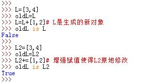

<!--
    作者：华校专
    email: huaxz1986@163.com
**  本文档可用于个人学习目的，不得用于商业目的  **
-->
# 赋值语句
1.赋值的左侧可以为变量名或者对象元素，右侧为任何表达式

* 赋值总是建立对象的引用值，而不是复制对象
* 变量名会在首次被赋值时创建。此后，每当这个变量名出现在表达式中时，会被它引用的对象所替代
* 变量名必须先赋值后引用，否则报错
* 模块导入、函数定义、类定义、`for`循环、函数参数传递 等过程都会触发隐式赋值，原理、规则同显式赋值

2.赋值语句的形式：

* 基本形式： `x='abcd'`
* 元组赋值： `a,b="ab","cd"`，按照位置一一对应赋值
* 列表赋值： `[a,b]=["ab","cd"]`，按照位置一一对应赋值
* 扩展的序列解包赋值： `a,*b="abcd"`，结果是 `b`等于`['b','c','d']`
* 多目标赋值： `a=b="abcd"`
	>注意此时`a`和`b`都引用同一个对象。如果这个对象是个可变对象，则使用`a`或者`b`
	  对它进行原地修改可能导致陷阱
* 增强赋值： `a+='ef'`，等价于`a=a+`ef`
	>若`a`指向的是可变对象，则`+=`很有可能是原地操作  
	> 所有的二元表达式运算符均有增强赋值语句  

3.Python3中，元组和列表赋值统一化为序列赋值：`a,b=['ab','cd']`，左侧为任何类型的变量名序列，右侧为任何类型的值序列，只需要变量名序列和值序列长度相等。赋值时根据位置一一对应赋值。

* 若变量名序列和值序列长度不等，则抛出`ValueError`异常
* 支持嵌套的赋值序列，Python会自动根据实际情况分解成其组成部分，然后递归赋值。要求左侧变量名序列的嵌套形状必须符合右侧值序列的嵌套形状。  

4.扩展的序列解包赋值：收集右侧值序列中未赋值的项为一个列表，将该列表赋值给带星号`*`的变量

* 左边的变量名序列长度不需要与值序列的长度相等，其中只能有一个变量名带星号`*`
	* 若带星号`*`变量名只匹配一项，则也是产生一个列表，列表中只有一个元素，如`a,*b="12"`，`b`为`[2]`
	* 若带星号`*`变量名没有匹配项，则也是产生空列表，如`a,*b="1"`，`b`为`[]`
* 带星号`*`的变量名可以出现在变量名序列中的任何位置如`*a,b="1234"`，`a`为`[1,2,3]`
* 匹配过程优先考虑不带星号的变量名，剩下的才匹配带星号的变量名
* 以下情况会引发错误：
	* 左侧变量名序列有两个星号，如`*a,*b="abcd"`
	* 左侧变量名序列无星号但是左右长度不匹配，如`a,b="abcd"`
	* 左侧变量名序列星号的名称不在序列中，如`*a='abcd'`
* 可以用手动分片来模拟扩展赋值行为  

5.增强赋值的优点：

* `X+=Y`中，`X`可以是复杂的对象表达式，只需要求值一次。而`X=X+Y`中，要对`X`求值两次
* 对支持原地修改的对象而言，增强形式的赋值会自动执行原地修改的预算：
	* `L=L+[1,2]`会生成新对象
	* `L+[1,2]`会执行原地修改  

	

